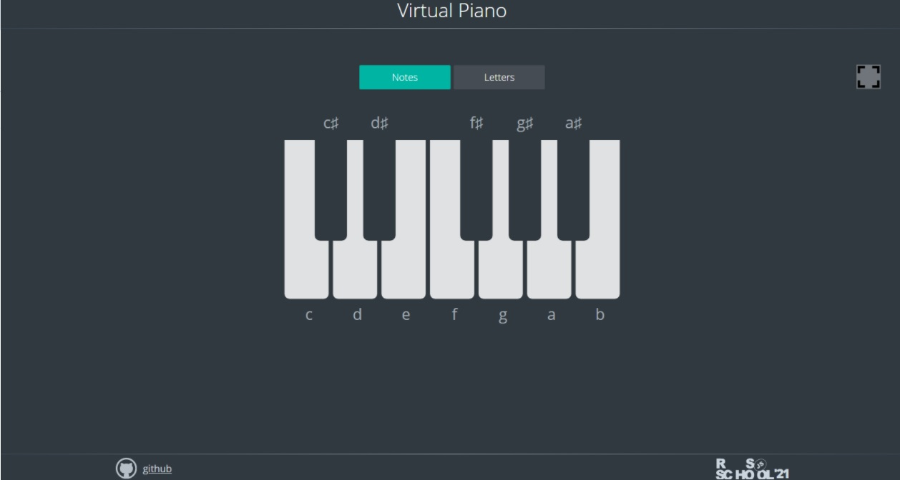

## Task . Virtual-piano от [RSS School](https://rs.school/)

### **Проект  Virtual-piano [(готовый)](https://marinatwice82.github.io/virtual-piano/)**

### Описание:

* На странице отображаются клавиши пианино. Возле клавиш пианино отображаются или названия соответствующих этим клавишам нот. Есть иконка для перехода в полноэкранный режим.

* При клике по клавише пианино мышкой проигрывается соответствующая этой клавише нота, клавиша переходит в активное состояние
при клике по клавише клавиатуры, которая соответствует клавише пианино, проигрывается нота, клавиша переходит в активное состояние.

* Нота проигрывается вне зависимости от раскладки клавиатуры (русская или английская) и состояния клавиши CapsLosk. Совместная работа и взаимодействие мышки и клавиатуры не проверяется и не оценивается.

### [Описание задания](https://rolling-scopes-school.github.io/stage0/#/stage1/tasks/js-projects/virtual-piano)